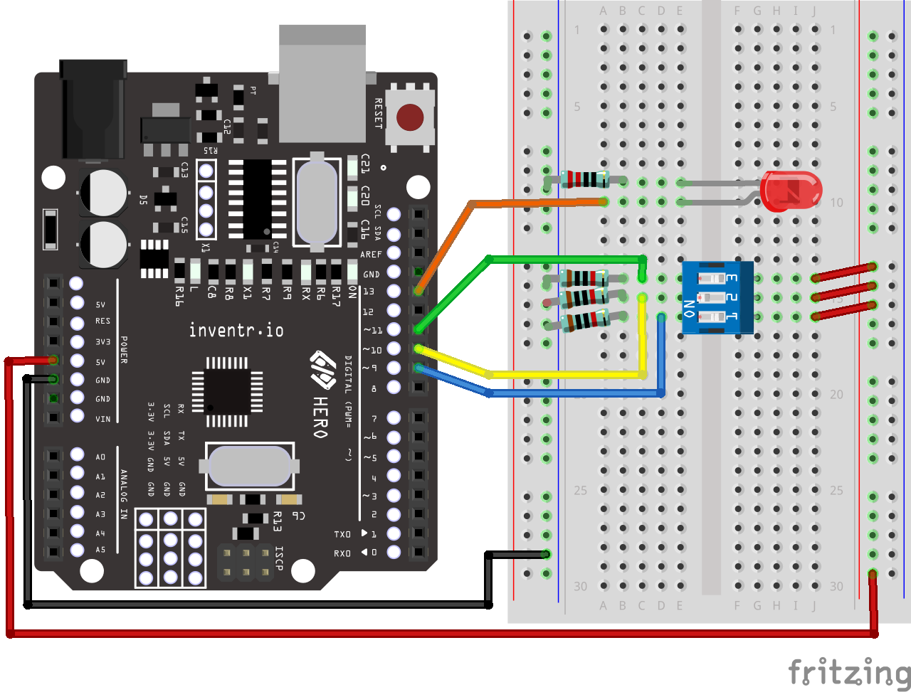
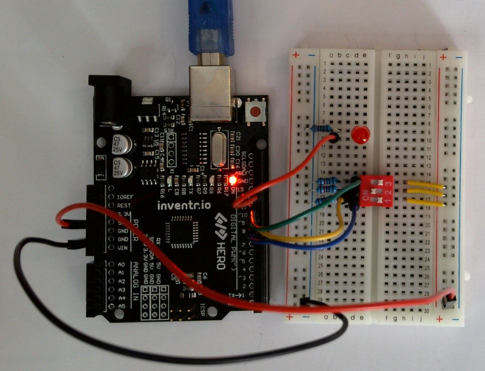

# Solution to 103 Morse Code Challenge
Here is one possible solution to the 103 project challenge

## Fritzing Diagram
<i>[(Click here for full size image)](103-Morse-Code_bb.png)</i> 

## Code
[103-Morse-Code.ino](103-Morse-Code.ino)

In our code:
- Switch 1 spells out SOS
- Switch 2 spells out TTT (another distress signal)
- Switch 3 spells out HELP
- When all switches are on, each message plays in sequence.

## Video
[YouTube](https://youtu.be/xAKKrt2HJ-A)

## Picture

