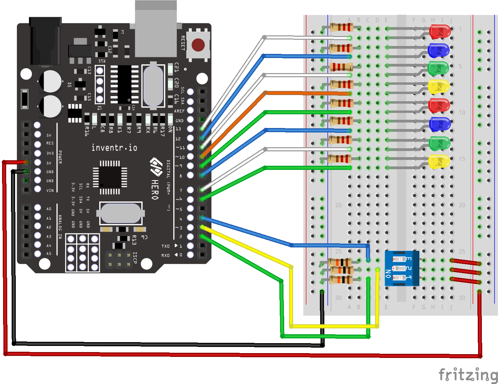
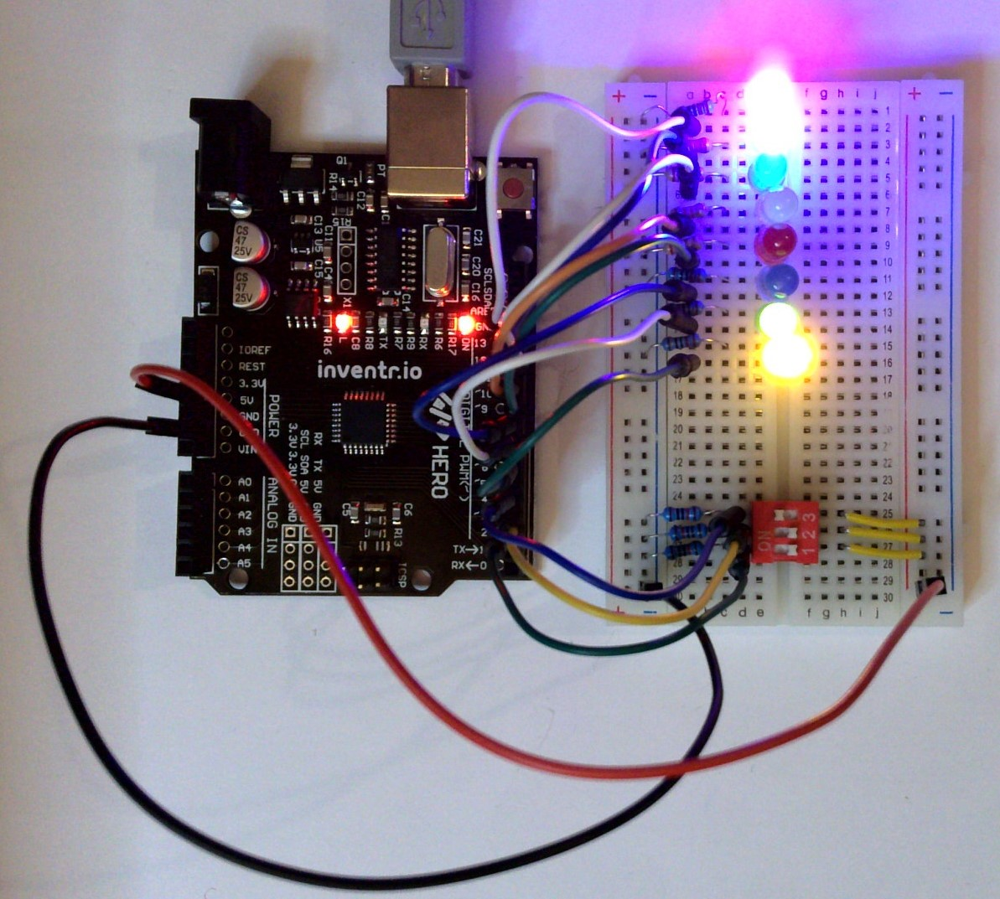

# Solution to 105 LED Scanner Challenge
Here is one possible solution to the 105 project challenge

## Fritzing Diagram
<i>[(Click here for full size image)](105-LED-Scanner_bb.png)</i> 

## Code
[105-LED-Scanner.ino](105-LED-Scanner.ino)

## Video
[YouTube](https://youtu.be/K_oJ6lxTDfk)

## Picture

