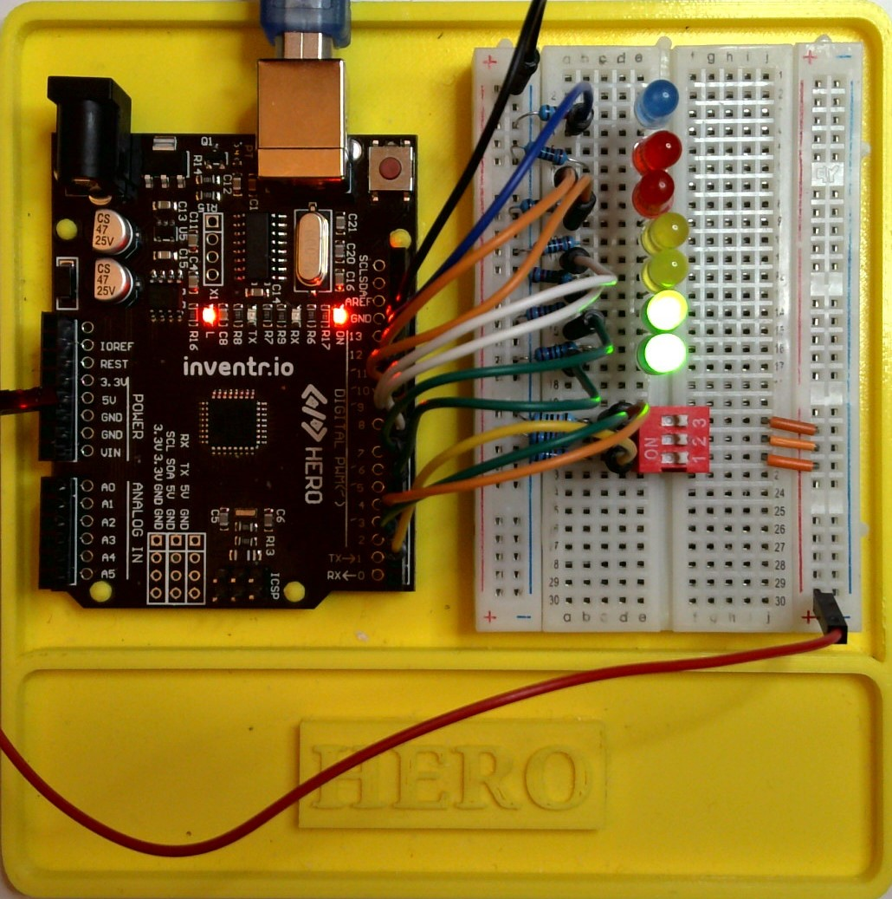

# Solution to 110 - Timer - version 1
Here is one possible solution to this project challenge

## Fritzing Diagram

## Code
[110-Timer-v1.ino](110-Timer-v1.ino)

## Video
[YouTube](https://youtu.be/atBzyxvfKSI)

## Picture

